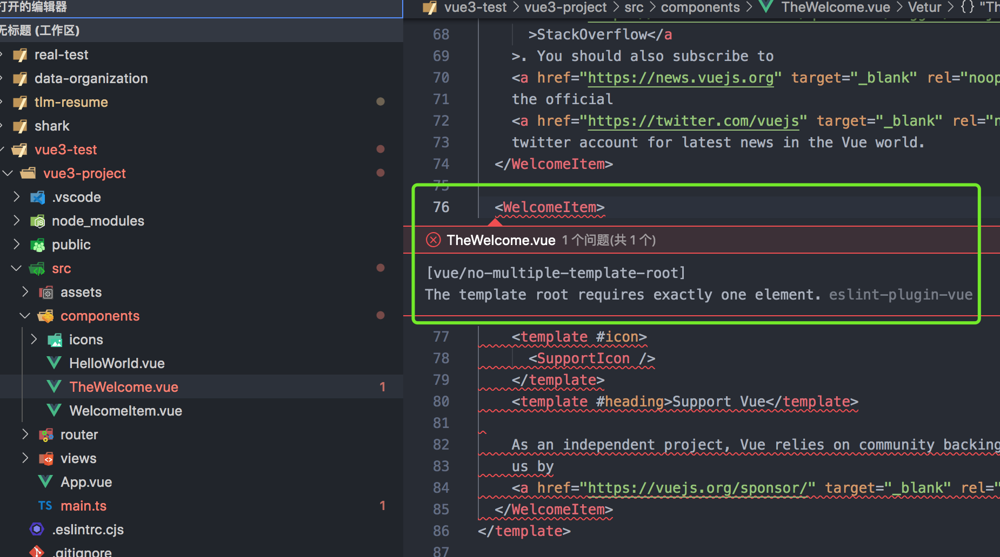

# 1.tsconfig.json 报错

```
Flag 'importsNotUsedAsValues' is deprecated and will stop functioning in TypeScript 5.5. Specify 'ignoreDeprecations: "5.0"' to silence this error. Use 'verbatimModuleSyntax' instead.ts
```

可以通过在项目中添加以下命令来隐藏此警告：`tsconfig.json`

```ts
{
  "compilerOptions": {
    "ignoreDeprecations": "5.0",
    ....
  }
}
```

# 2.vscode 中报错 vue 模板只能有一个根元素



由于 vue3 已经支持多个根元素了，所以代码并没有报错，而 vscode 中的 eslint 中的 vue 校验 vetur 还没有更新，还认为是 vue2 项目所以就报错了。

可见：https://github.com/vuejs/vetur/issues/2299#issuecomment-696015374

[Vue 3 模板根只需要一个 element.eslint-plugin-vue](https://qa.1r1g.com/sf/ask/4540725311/#)

[stackoverflow---Vue 3 The template root requires exactly one element. eslint-plugin-vue](https://stackoverflow.com/questions/64867504/vue-3-the-template-root-requires-exactly-one-element-eslint-plugin-vue)

```json
"vetur.validation.template": false,
"vetur.validation.script": false,
"vetur.validation.style": false,
```

# 3.vue 官方实例

https://cn.vuejs.org/examples/#markdown

# 4.script 中直接使用 setup

```html
<script setup lang="ts">
  import {ref} from 'vue'

  let count = ref(0) // 响应式数据的话需要使用ref

  const updateCount = () => count.value++
</script>
<template>
  {{count}}
  <button @click="updateCount">更新数据</button>
</template>
```

# 5.[尤雨溪 Vue Function-based API RFC](https://zhuanlan.zhihu.com/p/68477600)

```js
import {ref, computed, watch, onMounted} from 'vue'

const App = {
  template: `
    <div>
      <span>count is {{ count }}</span>
      <span>plusOne is {{ plusOne }}</span>
      <button @click="increment">count++</button>
    </div>
  `,
  setup() {
    // reactive state
    const count = ref(0)
    // computed state
    const plusOne = computed(() => count.value + 1)
    // method
    const increment = () => {
      count.value++
    }
    // watch
    watch(
      () => count.value * 2,
      (val) => {
        console.log(`count * 2 is ${val}`)
      }
    )
    // lifecycle
    onMounted(() => {
      console.log(`mounted`)
    })
    // expose bindings on render context
    return {
      count,
      plusOne,
      increment,
    }
  },
}
```

- 设计动机是逻辑组合与复用、类型推导、打包尺寸

  - 都写在 setup 中为了逻辑抽取更方便，不用某一个逻辑分散在 watch,methods 里面不好组合拿出来
  - 更好的支持 ts，使用 ts 的类型推导
  - 全写在 setup 中便于压缩，更易导出，tree-shaking 更容易

- 确实借鉴了 react hooks

- setup(props)的参数是 props，props 是响应式的

- ref()返回的是一个 value reference(包装对象)，包装对象只有一个属性 value。包装对象的意义就在于提供一个让我们能够在函数之间以引用的方式传递任意类型值的容器；有了这样的容器，我们就可以在封装了逻辑的组合函数中将状态以引用的方式传回给组件。组件负责展示（追踪依赖），组合函数负责管理状态（触发更新）

- 包装对象在 template 模板中直接使用，不用加.value

- 没有包装的响应式对象 reactive api

- computed、watch 均可以在其中直接用

- watch 的第二个函数的第三个参数可以用来注册清理操作的函数

- 默认情况下，所有的 watcher 回调都会在当前的 renderer flush 之后被调用。这确保了在回调中 DOM 永远都已经被更新完毕

- 生命周期函数有对应的 onXXX 函数`import { onMounted, onUpdated, onUnmounted } from 'vue'`

- 类型推导`import { defineComponent } from 'vue'`

  ```js
  const MyComponent = defineComponent({
    // props declarations are used to infer prop types
    props: {
      msg: String,
    },
    setup(props) {
      props.msg // string | undefined

      // bindings returned from setup() can be used for type inference
      // in templates
      const count = ref(0)
      return {
        count,
      }
    },
  })
  ```

  `defineComponent` 从概念上来说和 2.x 的 `Vue.extend` 是一样的，但在 3.0 中它其实是单纯为了类型推导而存在的，内部实现是个 noop（直接返回参数本身）。它的返回类型可以用于 TSX 和 Vetur 的模版自动补全。如果你使用单文件组件，则 Vetur 可以自动隐式地帮你添加这个调用

- Vue 提供的 `PropType` 类型可以用来声明任意复杂度的 props 类型，但需要用 `as any` 进行一次强制类型转换:

  ```js
  props: {
      options: (null as any) as PropType<{ msg: string }>
    }
  ```

- 尤大意思不用很担心会写出很多的面条代码，因为现在的新 api 更容易去组织代码去抽取函数

# 6.ref

ref 是一个函数，定义一个响应式的数据

返回一个 Ref 对象，对象中有一个 value 属性

html 模版中不需要写.value

一般用来定义一个**基本类型**的响应式数据

# 7.vue 中使用 Element-Plus

## 1.vue3 中使用 Element-Plus 覆盖默认样式不起作用

style 的地方不能使用 scope

## 2.使用 css 变量来更改样式

[通过 CSS 变量设置](https://element-plus.gitee.io/zh-CN/guide/theming.html#%E9%80%9A%E8%BF%87-css-%E5%8F%98%E9%87%8F%E8%AE%BE%E7%BD%AE)

```js
<el-card
  class="box-card"
  shadow="never"
  style="--el-card-padding:10px"
></el-card>
```

# 8.vue 项目，vscode 保存格式一直不起作用

原来是项目中没有.editorconfig 文件。

# 9.vite 配置的项目，extensions 配置无用了

vite 中导入.vue 文件时后缀不能省，配置 extensions 也不行，官方已经不允许不使用 vue 文件后缀导入了

链接https://github.com/vitejs/vite/issues/178

# 10.ref 和 reactive 的区别

ref 是包装基本类型为响应式数据

reacttive 是包装对象为响应式数据，Proxy 对象的数据

如果使用 ref 包装数组/对象，内部会自动将对象/数组转为 reactive 的代理对象

# 11.defineComponent

纯粹是为了 ts 类型提示的组件

比如写上 defineComponent 之后，其中 setup 的参数 props 就可以有类型提示了

# 12.setup

setup 在执行的时候，组件还没有创建出来，也就是 this 是 undefined，如此就不能通过 this 去调用 data/computed/methods/props 中的相关内容了

data 和 setup 或者 methods 和 setup 中的方法会合并，如果相同的话，setup 中的优先级高

setup 的参数：

```js
setup(props,context){
  // context里面是attrs，slot，emit
}
```

# 13.vue3 中的 Fragment

开始看到这个的时候以为和 react 中一样的用法，所以直接就在循环外使用了，结果控制台一直报警告，后来看了一下，vue3 中的这个是为了解决根元素上只能有一个元素的问题，现在 vue3 可以有多个了，当你写多个元素的时候，vue3 内部直接会给你自动加上一个 fragment，但是在页面元素那里不展示，而你可以在 devtool 中看到；

在 vue 中像 react 的一样用法可以使用`<template></template>`,这效果和 React.Fragment 是一样的
